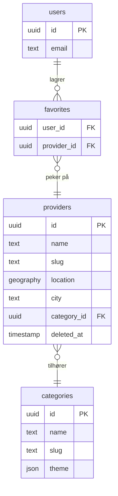

# FitHub – CLAUDE.md

> Prosjektets sannhetskilde. Alle agenter leser denne ved oppstart.
> Oppdateres av PM-agenten. Sist oppdatert: 2026-06-17

---

## Kommandoer

| Kommando | Bruk |
|----------|------|
| `npm run dev` | Dev server (ports 3000–3002 kan alle være i bruk — sjekk først) |
| `npm run build` | Produksjonsbygg |
| `npx tsc --noEmit` | Type-sjekk |
| `npx tsx scripts/<name>.ts` | Kjør scripts |

---

## Tech-stack

Next.js 14 App Router · React **18.2** · TypeScript · Supabase (PostgreSQL + PostGIS) · Tailwind CSS

---

## Nøkkelfiler

| Fil | Rolle |
|-----|-------|
| `app/page.tsx` | Forside — server component, importerer CategoryGrid |
| `components/CategoryGrid.tsx` | 4-tile grid, GPS, Oslo bydel-picker — `'use client'` |
| `app/resultater/page.tsx` | Resultater server component — kaller `searchServices()` direkte, ingen cache |
| `app/resultater/ResultsView.tsx` | Resultater client component — tag-panel, kart, kortliste |
| `lib/matchingDb.ts` | `searchServices()` — direkte Supabase RPC, ingen cache-lag |
| `lib/categoryConfig.ts` | 4 kategorier med temafarger og tag-valg |
| `sql/01_postgis_and_search.sql` | `search_services()` SQL-funksjon (14 params) |
| `CLAUDE.md` | Denne filen — prosjektets sannhetskilde |
| `handoff.md` | Delt tavle mellom agenter |
| `specs/active/` | Pågående feature-specs |
| `specs/done/` | Arkiverte specs |
| `.claude/skills/` | Domene-skills (00-index.md + 01–09) |

---

## Domenekart

| # | Domene | Nøkkelansvar |
|---|--------|-------------|
| 01 | Search & Discovery | Søk, filtrering, PostGIS radius-søk |
| 02 | Frontpage & Categories | Forside, kategorisider |
| 03 | Group Sessions & Events | Gruppeøkter, timeplan |
| 04 | Provider / Tilbyder | Leverandørprofiler, detaljsider |
| 05 | User Profile | Brukerkontoer, favoritter |
| 06 | Email & Notifications | Transaksjonsmail, varsler |
| 07 | Infrastructure & Shared | Delt kode, middleware, Supabase-klienter |
| 08 | Payments & B2B | Betalingsflyt, B2B-abonnement |
| 09 | Admin & Data Import | Admin-panel, dataimport av leverandører |

---

## Kodestandarder

- **Ingen kommentarer** med mindre HVORFOR er ikke-åpenbar (constraint, workaround, subtil invariant)
- **React 18.2**: `useFormState` + `useFormStatus` fra `react-dom` — aldri `useActionState` (React 19 only)
- **Dynamiske temafarger**: inline `style={{color: theme.accent}}` — ikke dynamiske Tailwind-strenger (purges ved bygg)
- **TypeScript**: strict; `unknown` + narrowing over `any`
- Ingen premature abstraksjoner; ingen feilhåndtering for umulige case; ingen bakoverkompatibilitets-shims

---

## Kritiske gotchas

### Nominatim reverse geocoding
Fallback-rekkefølge **må** være: `city → town → municipality → village`
`municipality` før `village` — ellers vinner forsteder (f.eks. Konnerud) over selve byen (Drammen).
Både `reverseGeocode()` og `reverseGeocodeTop()` i `CategoryGrid.tsx` må følge denne rekkefølgen.

### City param-normalisering
Ta alltid første segment før sending til DB:
```ts
locationLabel.split(',')[0].trim().toLowerCase()
```
Nominatim kan returnere "Oslo, Norge" som `display_name` — uten dette finner `city='oslo, norge'` ingenting.

### `search_services()` SQL-funksjon
- **Etter hver `DROP + CREATE`**: kjør `GRANT EXECUTE ON FUNCTION search_services(...) TO anon, authenticated;`
- Behold `#variable_conflict use_column`-pragma øverst i funksjonskroppen
- 14 params totalt — siste to er `p_main_category text DEFAULT NULL, p_tags text[] DEFAULT NULL`

### Resultatsside-design
- Mørk kategori-header + gradientbar: les `catTheme` fra `getCategoryConfig(mainCategory)` i `page.tsx`
- Tag-filterpanel i `ResultsView.tsx`: leser `?cat` + `?tags` fra URL; aktiv chip-farge = `catConfig.theme.accent`
- Aldri kategori-spesifikke farger i Tailwind-klasser — bruk inline styles med theme-verdier

### Supabase
- Service-role client: KUN server-side (API routes). Aldri i klientkode.
- `.env.local`: `NEXT_PUBLIC_SUPABASE_URL` + `NEXT_PUBLIC_SUPABASE_ANON_KEY` — aldri commit

### Generelt
- **Aldri commit eller push** uten eksplisitt forespørsel
- **Bekreft før destruktive DB-operasjoner** (DROP, DELETE, TRUNCATE)
- **Image resize script**: `EBUSY` = fil åpen annetsteds — hopp over, lukk filen, kjør på nytt
- Aldri hard-delete audit-sensitive records — bruk `deleted_at`-flagg

---

## In progress

> PM-agenten oppdaterer denne seksjonen når en feature starter.

*(ingenting pågår akkurat nå)*

---

## Nylig levert

> Flyttes hit fra "In progress" når en spec arkiveres.

*(tomt — fyll ut etter hvert)*

---

## Arkitekturavgjørelser

| Beslutning | Begrunnelse |
|------------|-------------|
| App Router (ikke Pages Router) | Bedre for layout-nesting og server components |
| PostGIS for lokasjonsøk | Nødvendig for radius-søk på 27 000+ leverandører |
| React 18.2 (ikke 19) | Stabilitet — `useFormState`/`useFormStatus` API |

---

## Databasediagram (Mermaid)

> Oppdater når skjema endres.


