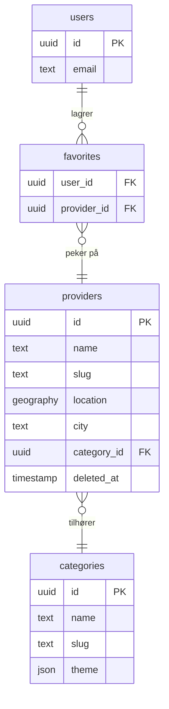

# FitHub – CLAUDE.md

> Prosjektets sannhetskilde. Alle agenter leser denne ved oppstart.
> Oppdateres av PM-agenten. Sist oppdatert: 2026-06-20

---

## Kommandoer

| Kommando | Bruk |
|----------|------|
| `npm run dev` | Dev server (ports 3000–3002 kan alle være i bruk — sjekk først) |
| `npm run build` | Produksjonsbygg |
| `npx tsc --noEmit` | Type-sjekk |
| `npx tsx scripts/<name>.ts` | Kjør scripts |

---

## Tech-stack

Next.js 14 App Router · React **18.2** · TypeScript · Supabase (PostgreSQL + PostGIS) · Tailwind CSS

---

## Nøkkelfiler

| Fil | Rolle |
|-----|-------|
| `app/page.tsx` | Forside — server component: Hero → Verditilbud → "Aktiviteter nær deg" → CategoryGrid |
| `components/CategoryGrid.tsx` | 8-tile grid (7 søkekategorier + Turruter-flis) — `'use client'`, lokasjon kommer fra `SearchLocationBar` |
| `components/SearchLocationBar.tsx` | Samlet søk/lokasjon-felt i toppfanen (erstatter gamle `LocationBar.tsx`) — "Smart søk"-veksling mellom adressefelt og fritekstsøk |
| `components/home/` | `HomeHero.tsx`, `HomeValueProps.tsx`, `HomeNearbyActivities.tsx` — nye forside-seksjoner |
| `app/resultater/page.tsx` | Resultater server component — kaller `searchServices()` direkte, ingen cache |
| `app/resultater/ResultsView.tsx` | Resultater client component — tag-panel, kart, kortliste |
| `lib/matchingDb.ts` | `searchServices()` — direkte Supabase RPC, ingen cache-lag |
| `lib/categoryConfig.ts` | 7 kategorier med temafarger og tag-valg |
| `sql/01_postgis_and_search.sql` | `search_services()` — **opprinnelig** signatur (14 params). IKKE kilden til sannhet lenger — se gotcha under |
| `CLAUDE.md` | Denne filen — prosjektets sannhetskilde |
| `handoff.md` | Delt tavle mellom agenter |
| `specs/active/` | Pågående feature-specs |
| `specs/done/` | Arkiverte specs |
| `.claude/skills/` | Domene-skills (00-index.md + 01–09) |
| `app/tur/page.tsx` | Geonorge turruter — frittstående kartside, ikke koblet til services/søk |
| `lib/trailsDb.ts` / `app/api/trails/route.ts` | Viewport-basert henting av turruter (`get_trails_in_bbox()` RPC) |
| `components/TrailMap.tsx` | Leaflet-kart for turruter + tettsteder, GPS-posisjon, fargekoding per rutetype, togglbart tettsted-lag |
| `lib/settlementsDb.ts` / `app/api/settlements/route.ts` | Viewport-basert henting av tettsteder (`get_settlements_in_bbox()` RPC). `findSettlementInQuery()` plukker stedsnavn ut av fritekstsøk |
| `lib/matchingDb.ts` | `searchServicesWithFallback()` — Tier 1→2→3-orkestrator rundt `searchServices()`/`searchServicesUnanchored()` |

---

## Domenekart

| # | Domene | Nøkkelansvar |
|---|--------|-------------|
| 01 | Search & Discovery | Søk, filtrering, PostGIS radius-søk |
| 02 | Frontpage & Categories | Forside, kategorisider |
| 03 | Group Sessions & Events | Gruppeøkter, timeplan |
| 04 | Provider / Tilbyder | Leverandørprofiler, detaljsider |
| 05 | User Profile | Brukerkontoer, favoritter |
| 06 | Email & Notifications | Transaksjonsmail, varsler |
| 07 | Infrastructure & Shared | Delt kode, middleware, Supabase-klienter |
| 08 | Payments & B2B | Betalingsflyt, B2B-abonnement |
| 09 | Admin & Data Import | Admin-panel, dataimport av leverandører |

---

## Kodestandarder

- **Ingen kommentarer** med mindre HVORFOR er ikke-åpenbar (constraint, workaround, subtil invariant)
- **React 18.2**: `useFormState` + `useFormStatus` fra `react-dom` — aldri `useActionState` (React 19 only)
- **Dynamiske temafarger**: inline `style={{color: theme.accent}}` — ikke dynamiske Tailwind-strenger (purges ved bygg)
- **TypeScript**: strict; `unknown` + narrowing over `any`
- Ingen premature abstraksjoner; ingen feilhåndtering for umulige case; ingen bakoverkompatibilitets-shims

---

## Kritiske gotchas

### Nominatim reverse geocoding
Fallback-rekkefølge **må** være: `city → town → municipality → village`
`municipality` før `village` — ellers vinner forsteder (f.eks. Konnerud) over selve byen (Drammen).
Både `reverseGeocode()` og `reverseGeocodeTop()` i `CategoryGrid.tsx` må følge denne rekkefølgen.

### City param-normalisering
Ta alltid første segment før sending til DB:
```ts
locationLabel.split(',')[0].trim().toLowerCase()
```
Nominatim kan returnere "Oslo, Norge" som `display_name` — uten dette finner `city='oslo, norge'` ingenting.

### `search_services()` SQL-funksjon
- **⚠️ `sql/01_postgis_and_search.sql` er IKKE kilden til sannhet** — funksjonen har blitt endret av
  flere senere migrasjoner (13: `p_offset`, 14: `cover_image_url`/`logo_image_url`, 21/23: `utendors`-gren).
  Den nyeste migrasjonsfilen med høyest nummer som inneholder `CREATE OR REPLACE FUNCTION search_services`
  er alltid den faktiske, kjørende versjonen. Sjekk ALLTID den nyeste, ikke `01_`-filen, før du endrer funksjonen.
- **Nåværende signatur: 16 params** — siste to er `p_radius_km double precision DEFAULT NULL, p_offset int DEFAULT 0`.
  Returnerer 24 kolonner inkl. `cover_image_url`, `logo_image_url`.
- **Etter hver `DROP + CREATE`**: kjør `GRANT EXECUTE ON FUNCTION search_services(...) TO anon, authenticated;`
  med EKSAKT samme parameter-signatur som funksjonen du nettopp opprettet.
- **Inkluder ALLTID `DROP FUNCTION IF EXISTS search_services(...)` for tidligere kjente signaturer FØR
  `CREATE OR REPLACE`** — ellers oppstår en duplikat-overload og PostgREST feiler med
  "Could not choose the best candidate function" på ALLE kall (skjedde 2026-06-30, se handoff.md-historikk,
  fikset i `sql/23_fix_search_services_overload.sql`). `CREATE OR REPLACE` erstatter KUN en funksjon med
  identisk parameterliste — en annen parameterliste skaper en ny, sameksisterende overload.
- Behold `#variable_conflict use_column`-pragma øverst i funksjonskroppen

### Resultatsside-design
- Mørk kategori-header + gradientbar: les `catTheme` fra `getCategoryConfig(mainCategory)` i `page.tsx`
- Tag-filterpanel i `ResultsView.tsx`: leser `?cat` + `?tags` fra URL; aktiv chip-farge = `catConfig.theme.accent`
- Aldri kategori-spesifikke farger i Tailwind-klasser — bruk inline styles med theme-verdier

### Supabase
- Service-role client: KUN server-side (API routes). Aldri i klientkode.
- `.env.local`: `NEXT_PUBLIC_SUPABASE_URL` + `NEXT_PUBLIC_SUPABASE_ANON_KEY` — aldri commit
- **PostgREST kapper svar til 1000 rader** uavhengig av `LIMIT` i SQL-funksjonen/RPC-kallet. Ved store
  datasett (f.eks. `trails`) må klienten enten paginere eller jobbe innenfor et avgrenset viewport/bbox.

### Geonorge-koordinater (EPSG:3035)
Akserekkefølgen er **(Northing, Easting)**, ikke (Easting, Northing) som man intuitivt forventer.
Verifisert empirisk mot et kjent punkt (Sør-Varanger/Kirkenes) — uten swap lander koordinater
~150 km feil sted. Se kommentar i `scripts/parse-geonorge-trails.ts`.

### Supabase upsert + partiell unik indeks
`CREATE UNIQUE INDEX ... WHERE col IS NOT NULL` (partiell indeks) matcher IKKE PostgREST sin
`upsert(onConflict: 'col')` — `ON CONFLICT`-generering støtter ikke WHERE-betingelse i inferens.
Bruk en vanlig (ikke-partiell) unik indeks i stedet — trygt, siden NULL ≠ NULL i en vanlig UNIQUE-indeks.

### Wikipedia "Tettsteder i [fylke]"-sider (tettsted-import)
- **15 fylker, ikke 19** — Norges nåværende fylkesstruktur. Det finnes en egen Wikipedia-subkategori
  "Lister over tettsteder i Norge før 2024" med utdaterte forkasider (Viken, Vestfold og Telemark,
  Troms og Finnmark, Hedmark, Oppland, Buskerud 2017, Hordaland, Sogn og Fjordane) — disse skal IKKE
  brukes. Bekreft kanonisk sideliste via Wikipedias kategori-API, ikke gjetning.
- **Befolkning/areal/tetthet finnes KUN i rendret HTML, ikke i wikitext** — malen som genererer
  tabellen slår opp disse tallene fra en ekstern kilde (sannsynligvis Wikidata/Lua-modul). Hent med
  `action=parse&prop=text`, ikke regex mot rå wikitext.
- **"Grå/parentes"-tall er CSS-klasser, ikke tegn i teksten** — `rtdelvis`/`kommsamlet{gruppe}` på
  aggregatrader, `kommsplit` på per-kommune-underrader (8-sifret nummer = 4-sifret foreldrenummer +
  4-sifret kommunenr). Bruk ALLTID raden med `<i>Tilsammen</i>` som autoritativ for et
  multi-kommune-tettsted — underradene har aldri befolkning/areal/koordinater og skal ikke lagres.
- Samme tettstedsnummer kan dukke opp på flere fylkesiders tabeller (grensetettsteder) — verdiene er
  identiske på alle sider, så enkel upsert på nummer er trygt uten cross-page-dedup.
- Enkelte rader har genuint ingen koordinater selv i rendret HTML — hopp over, ikke anta alle rader har dem.

### Next.js App Router: ikke-ASCII tegn i dynamiske route-segmenter
`params.id` i en `[id]`-side dekodes IKKE automatisk av Next.js for ikke-ASCII-tegn (æøå m.fl.) —
en URL med `%C3%B8` gir `params.id` som den LITERALE teksten `%C3%B8` (ikke `ø`), ikke den dekodede
verdien. Et `.eq('id', params.id)`-DB-oppslag matcher da aldri raden, selv om strengen er identisk
i et frittstående script. Verifisert empirisk 2026-06-20 — 41 % av importerte anleggs-ID-er
(`anl_*`) inneholdt æøå og var alle affisert. **Fiks**: kjør `decodeURIComponent(id).normalize('NFC')`
på parameteren FØR ethvert DB-oppslag, og bruk `encodeURIComponent()` konsekvent overalt en lenke
til siden bygges (inkl. sitemap/JSON-LD/canonical-URL). Se `app/tilbyder/[id]/page.tsx`s
`normalizeServiceId()` for referanseimplementasjon.

### Trigram-matching: `similarity()` vs `word_similarity()`
`similarity()`/`%` (brukt i `search_services()`) sammenligner trigram-SETT for hele begge strenger
og straffer lengdeforskjell hardt — et kort søkeord (f.eks. "yoga") mot en lang sammensatt
`search_text` (navn+beskrivelse+tags+by+adresse) scorer typisk 0.14–0.16, godt under standard
threshold 0.3, selv om ordet faktisk finnes der. Verifisert empirisk 2026-06-18 i
`search_services_unanchored()` (`sql/24_search_fallback_tiers.sql`). **Bruk `word_similarity()`/`<%`
i stedet** når du matcher et kort ord/uttrykk mot en lang fritekstkolonne — den måler likhet mot
beste SUBSTRENG i target, riktig semantikk for "finn dette ordet et sted i teksten".

### "Rapporter feil" — umiddelbar skjuling uten godkjenning
`reportService()` (`app/tilbyder/[id]/actions.ts`) setter `services.reported_at` umiddelbart ved
FØRSTE rapport — ingen terskel, ingen admin-godkjenning før raden forsvinner fra
`search_services()`. Dette var en bevisst, eksplisitt forenkling fra bruker for denne runden
(2026-06-21), **ikke en ferdig løsning** — misbrukspotensial: hvem som helst kan skjule en
konkurrents oppføring med ett anonymt klikk (rate-limitert 5/time per IP, men ikke mer). **Må
revurderes før launch** — sannsynlig fiks: terskel (N rapporter) eller admin-godkjenningskø før
`reported_at` settes. Raden slettes aldri — kun filtrert bort av søket, fortsatt synlig direkte i DB.

### Generelt
- **Aldri commit eller push** uten eksplisitt forespørsel
- **Bekreft før destruktive DB-operasjoner** (DROP, DELETE, TRUNCATE)
- **Image resize script**: `EBUSY` = fil åpen annetsteds — hopp over, lukk filen, kjør på nytt
- Aldri hard-delete audit-sensitive records — bruk `deleted_at`-flagg

### SQL-migrasjoner kjøres ALLTID manuelt av bruker/PM
- Det finnes **ingen** programmatisk vei til å eksekvere DDL mot Supabase i dette miljøet:
  ingen `exec_sql`-RPC, ingen `DATABASE_URL`/direkte Postgres-connection i `.env.local`, `pg`-pakken er ikke installert.
- Backend-agentens oppgave stopper ved å **opprette** `sql/NN_navn.sql`-filen og beskrive innholdet i handoff.md.
  Agenten skal IKKE forsøke å koble til databasen, lete etter en RPC for å køre SQL, eller rapportere seg "blokkert" av dette —
  det er forventet arbeidsflyt, ikke en feil. Alle migrasjoner 00–21 er kjørt manuelt via Supabase SQL Editor av bruker.
- Når en ny migrasjonsfil er opprettet: marker den i handoff.md under "Neste steg" med "Blokkert av: bruker må kjøre SQL i Supabase SQL Editor".
  PM krysser av når bruker bekrefter at den er kjørt.

---

## In progress

> PM-agenten oppdaterer denne seksjonen når en feature starter.

*(ingenting pågår akkurat nå)*

---

## Nylig levert

> Flyttes hit fra "In progress" når en spec arkiveres.

### Idrett-illustrasjoner + "Rapporter feil"-flagg — 2026-06-21
- Ny `lib/serviceIllustrations.tsx`: navnebasert ikon-gjenkjenning (håndball, fotball, kampsport,
  ski, svømming, tennis, basketball, volleyball, badminton, yoga, styrke, løping/kondisjon) +
  generisk fallback per `ServiceType`, vist i `HomeNearbyActivities.tsx`/`ResultsView.tsx` når
  `cover_image_url` mangler — hånd-tegnede inline SVG-er, samme stil som `HomeValueProps.tsx`
- Ny "Rapporter feil"-knapp på `/resultater`-kort + tilbyder-profilsiden (`ReportIssueModal.tsx`),
  åpen for alle, rate-limitert 5/time per IP. Ny `services.reported_at`-kolonne + `service_reports`-
  tabell (`sql/30_service_reports.sql`), `search_services()` filtrerer på `reported_at IS NULL`
- **Bug funnet og fikset under frontend-verifisering**: rapporter-lenken på profilsiden lå
  feilaktig inni samme betingelse som Kontakt-seksjonen, så den var usynlig for tjenester uten
  NOEN kontaktfelt (bekreftet på flere reelle `para_*`-rader)
- **Se gotcha om umiddelbar skjuling uten godkjenning** — bevisst forenkling, må revurderes før launch

### Forside-kategorier (7 fliser) — 2026-06-30
- Ny "Utendørs"-flise (tuftepark/utetrening, pluss plassholder-tag "fellestimer" for fremtidig oppmeldingstjeneste)
- Paraidrett-flisen bruker nå `/bilder/HC/`-bildene (redirect-til-aktivitet-sport-logikken er uendret)
- Nye visningsnavn: Trene selv→Egentrening, Trene sammen→Gruppetime, Aktivitet & sport→Sport (samme tekniske key-strenger, kun label endret — ingen URL/DB-rename)
- Additiv SQL-migrasjon `sql/21_add_utendors_category.sql` — la til `WHEN 'utendors' THEN ARRAY['outdoor']` i `search_services()` sin CASE-matching
- **Incident**: migrasjon 21 ble bygget fra utdatert `01_postgis_and_search.sql` og skapte en duplikat
  funksjonsoverload (se gotcha over). Fikset i `sql/23_fix_search_services_overload.sql`.
- Spec arkivert: `specs/done/forside-kategorier/`

### Geonorge turruter (`/tur`) — 2026-06-30
- 163 781 ruter nasjonalt (fotrute/skiløype/sykkelrute/annet), viewport-basert Leaflet-kart
- Frittstående delsystem — ingen kobling til `services`/`search_services()`/`categoryConfig.ts` (bevisst valg)
- Ny tabell `trails` + RPC `get_trails_in_bbox()` (`sql/22_trails.sql`), nye npm-pakker `sax`/`proj4`
- Engangsimport, ingen cron — re-kjøring av `scripts/parse-geonorge-trails.ts` + `push-geonorge-trails.ts` er idempotent
- Kjent begrensning: PostgREST kapper til 1000 rader uavhengig av viewport-størrelse (se gotcha)

### Søk-fallback-kjede (Tier 1/2/3) — 2026-06-18
- Fritekstsøk finner nå navnetreff og stedsnavn-treff selv når de er utenfor brukerens
  lokasjonsmarkør, uten å permanent flytte markøren. 3 nivåer, stopper ved første som gir treff:
  Tier 1 (forbedret `search_text` med by/adresse, samme `search_services()`-kall), Tier 2 (gjenkjenn
  stedsnavn i søketeksten mot `settlements`-tabellen, rekoordiner søket dit), Tier 3 (helt
  frittstående `search_services_unanchored()`, ingen dekningsbegrensning, merket "Utenfor ditt
  område")
- `search_services()` selv **uendret** — kun trigger-utvidelse + ny frittstående funksjon (`sql/24_search_fallback_tiers.sql`)
- Tier 2 bygget mot `settlements`-tabellen (961 tettsteder + 108 byer) i stedet for en hardkodet
  byliste — gjenbruker eksisterende `getSettlementsInBounds()` med en Norge-dekkende bbox, ingen ny SQL
- Kategori-nettlesing uten fritekst er helt uberørt (ett RPC-kall, som før)
- Spec arkivert: `specs/done/sok-fallback-kjede/`

### Tettsteder-lag på `/tur` — 2026-06-18
- 961 tettsteder nasjonalt (navn, kommune, folketall, koordinater), togglbart punktlag på samme kart som turrutene
- Kilde: Wikipedias "Tettsteder i [fylke]"-sider (15 fylker — IKKE 19, se gotcha under), parset fra rendret HTML (ikke wikitext)
- Ny tabell `settlements` + RPC `get_settlements_in_bbox()` (`sql/25_settlements.sql`), samme pipeline-mønster som turruter
- Frittstående — ingen kobling til søk/`categoryConfig.ts`. Den pausede spec'en `sok-fallback-kjede` er bevisst frikoblet
- Kjent, ikke-kritisk særtrekk: `municipality`/`county` for grensetettsteder (f.eks. Drammen) kan være `NULL` eller satt til "feil" fylke — tettstedet strekker seg over en grense, og verdien avhenger av hvilken fylkesside dataene først ble lest fra. Befolkning og koordinater er upåvirket og korrekte
- Engangsimport, ingen cron — re-kjøring av `scripts/parse-wikipedia-settlements.ts` + `push-wikipedia-settlements.ts` er idempotent

### "Søk her i stedet" + tag-filter-fiks — 2026-06-19
- Knapp på søketreff flytter lagret lokasjon til treffets sted (i stedet for ren kart-panorering),
  fjerner fritekst-`q`, beholder `cat`/`tags`/`radius`, fjerner `page`
- Fikset 2 reelle bugs i søk-fallback-kjeden: Tier 2 sendte feilaktig hele original-query på nytt
  i stedet for `remainder` (`sql/27` + `lib/matchingDb.ts`); Tier 3 (`search_services_unanchored()`)
  støttet ikke `p_tags` i det hele tatt — lagt til med samme retry-uten-parameter-mønster som
  `p_borough` for å unngå at ukjørt migrasjon brekker ALLE Tier 3-kall, ikke bare tag-filtrerte
- Første ekte Tier 2-suksess observert i prosjektet (Oslo→Drammen sportsklubb-søk)

### Samlet søk/lokasjon-felt i toppfanen — 2026-06-19
- `SearchLocationBar.tsx` erstatter `LocationBar.tsx` + de to embedded søkefeltene i
  `CategoryGrid.tsx`/`ResultsView.tsx` — ett felt, "Smart søk"-veksling styrer om det er et rent
  adressefelt (geokoding bevart) eller fritekstsøk (Tier 1/2/3-kjeden)
- Standard lokasjon Oslo + samtidig GPS-prompt ved første besøk (ingen lagret lokasjon)
- Oslo-bydel-velgeren fjernet helt (bekreftet dead code i backend før fjerning)
- **Race-condition-gotcha**: barn-komponenters `useEffect` kjører FØR foreldre-komponenters i React
  — en naiv `location===null`-sjekk i `SearchLocationBar` ville alltid vært sann ved første render
  og overskrevet en faktisk lagret lokasjon med Oslo på HVER sideload. Løsning: les `localStorage`
  direkte og synkront i stedet for å stole på context-state ved mount

### Turruter-flis på forsiden — 2026-06-19
- 8. flis ("Turruter") lenker til `/tur`, gjenbruker `CategoryCard` uendret (kun typen for
  `config.key` utvidet til å akseptere `'tur'` i tillegg til `MainCategory`) — `lib/categoryConfig.ts`/
  `MainCategory`/søkesystemet ikke rørt. Alltid klikkbar, uavhengig av lokasjon

### Homepage-rebrand — 2026-06-19/20
- Ny forside-komposisjon: Hero → Verditilbud → "Aktiviteter nær deg" → eksisterende `CategoryGrid`
  (uendret, kun flyttet nedover + `<h1>`→`<h2>`)
- Nye `brand.*`-fargetokens i `tailwind.config.js`, gjenbrukt fra eksisterende `categoryConfig.ts`-hex
  (`#0A1A0E` skoggrønn, `#D4872A` kobber) for visuell kontinuitet — `categoryConfig.ts` selv urørt
- "Aktiviteter nær deg" bygget på eksisterende `services`/`searchServices()` (ikke `group_sessions`,
  som har ~0 reelle rader i produksjon)
- Ny stor søkebar i hero (tekst/posisjon/kategori/dekorativ "når som helst"), toppfanens
  `SearchLocationBar` skjult kun på `/` via egen `ConditionalSearchBar`-wrapper (`usePathname()`)
- **Driftslærdom**: `npm run build` kjørt samtidig med aktiv `npm run dev` mot samme `.next`-mappe
  korrumperer dev-serverens webpack-chunk-referanser (hele siden 500, ikke bare testet rute) — se
  også egen feedback-memory om dev-server-koordinering mellom PM og kodeagenter
- Nye sider `/om-oss`, `/tilbydere`, `/magasin` (sistnevnte "kommer snart" — ingen CMS finnes)

### Stasjonære anlegg uten tilbyder — 2026-06-20
- Ny `provider_type` (`'business'|'facility'`) på `services` — skiller offentlige anlegg
  (tuftepark, hinderløyper fra Anleggsregisteret) fra kontaktbare bedrifter
- `/tilbyder/[id]` viser facility-modus for anlegg: adresse+Google Maps-lenke i stedet for
  Kontakt-seksjon, ingen "Krev profil"/"Send forespørsel", `Place` i stedet for `LocalBusiness` i JSON-LD
- Fant og fikset en STØRRE bug enn opprinnelig scope under empirisk Steg 0-undersøkelse: se
  ikke-ASCII-route-segment-gotcha ovenfor — affiserte 41 % av alle anleggs-rader (2064 av 5038)
- Alle 5020 `anl_*`-rader manglet `service_types` helt (0 hadde noen rad) — derav at de aldri
  dukket opp under tag-filtrert "Utendørs"-søk. Engangs-datakorreksjon + fikset ved kilden i
  `import-anleggsregisteret.ts`
- `orgnr` lagres bevisst IKKE for anlegg — `services.orgnr` har en UNIQUE-constraint, og mange
  anlegg deler samme eier-orgnr (f.eks. en kommune), som ville brutt constraint ved bulk-upsert
- **Utsatt oppfølging**: `app/dashboard/services/[id]/edit/page.tsx` kan ha samme id-encoding-bug
  for tilbyderes egne tjenester med æøå i ID — ikke verifisert ennå

---

## Arkitekturavgjørelser

| Beslutning | Begrunnelse |
|------------|-------------|
| App Router (ikke Pages Router) | Bedre for layout-nesting og server components |
| PostGIS for lokasjonsøk | Nødvendig for radius-søk på 27 000+ leverandører |
| React 18.2 (ikke 19) | Stabilitet — `useFormState`/`useFormStatus` API |

---

## Databasediagram (Mermaid)

> Oppdater når skjema endres.


